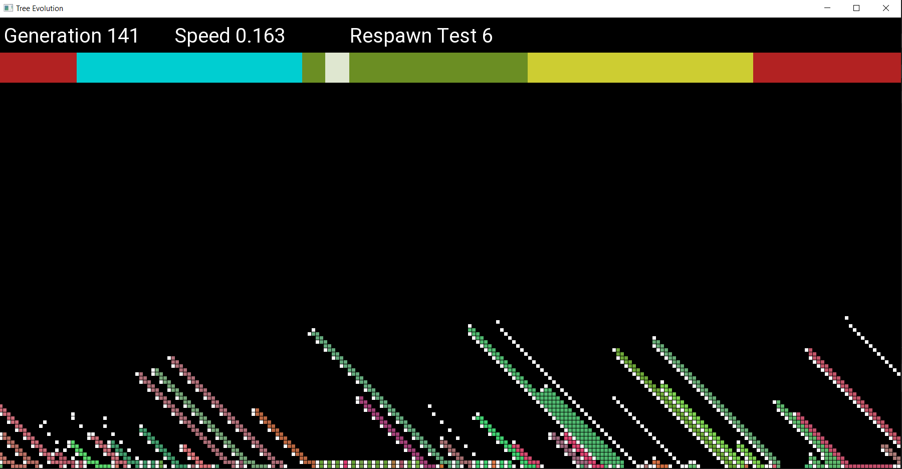
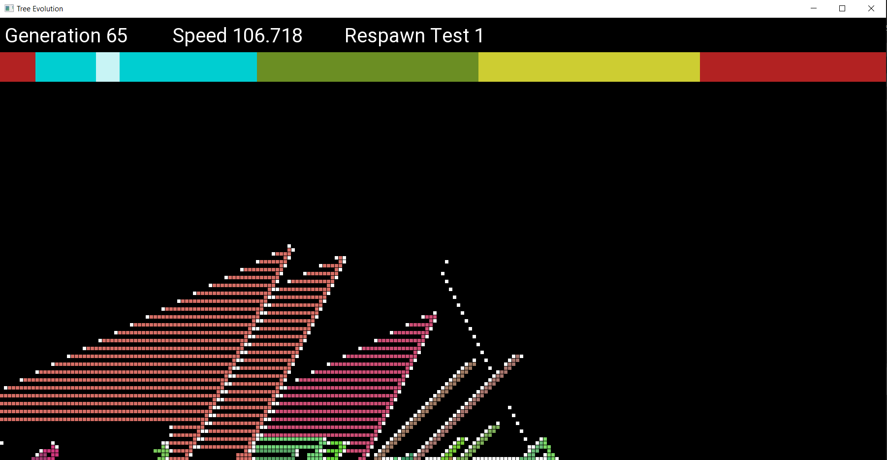

# TreeEvolution

Digital trees evolution depends on light level, hight, humidity and energy from root cell.

Each tree start with random genome, but only the best survive and populate full map.

You can speed-up or slow-down simulation speed using mouse scroll.

You can also choose initial genomes from saved library. To do so change to 1 value in Genome.h value of useDefauldGenomes (line 7).

